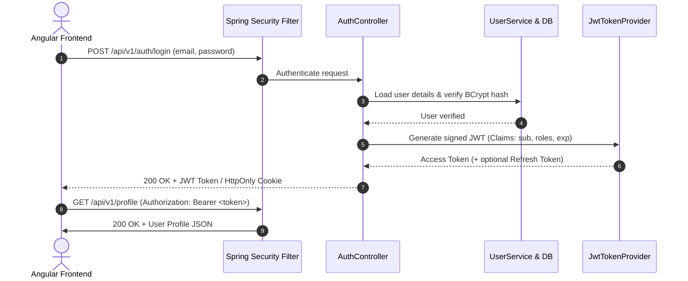

# Customer Authentication & Security Architecture

This document describes the customer authentication implementation in the RestaurantHub frontend application, its current prototype limitations, and the target architecture for the upcoming Spring Boot backend migration.

---

## 1. Current Implementation: Frontend Mock Authentication

The current authentication layer is a **client-side mock prototype** designed for frontend workflow testing, UI responsiveness, and state management demonstration.

### Key Architecture Components
- **`User` / `LoginCredentials` / `RegistrationData`**: Strongly-typed TypeScript models in `src/app/shared/models/user.model.ts`.
- **`AuthService` (`src/app/core/services/auth.service.ts`)**: Signal-driven reactive service exposing `currentUser` and `isAuthenticated` signals.
- **`authGuard` (`src/app/core/guards/auth.guard.ts`)**: Functional Angular route guard protecting `/profile`, `/orders`, and `/checkout`, forwarding intended destinations through `returnUrl`.
- **Temporary Persistence**: `localStorage` keys:
  - `restaurant-hub-auth-user`: Active user session metadata.
  - `restaurant-hub-mock-users`: Development mock user repository (seeded with demo user `rohan@restauranthub.com / Password123`).

---

## 2. Explicit Security Limitations (NOT Production Safe)

> [!CAUTION]
> The current authentication mechanism is **strictly a client-side prototype** and must never be deployed in a live production environment without the backend security layer.

Specific limitations:
1. **Client-Side Credential Verification**: Passwords are checked within the client browser rather than verified via secure server-side cryptographic hashing.
2. **Local Storage Identity State**: Session data in `localStorage` can be modified via developer tools and lacks tamper-proof cryptographic signatures.
3. **Mock Password Repository**: Mock user records in `localStorage` contain mock password strings for local prototyping. These are strictly isolated in development utilities and will be completely removed upon backend connection.
4. **Order History Association**: Order records in `OrderService` currently persist to browser `localStorage` as local prototype data and are not yet linked to authenticated database user IDs.

---

## 3. Future Spring Boot & JWT Production Architecture

During the backend integration phase, the mock authentication will be replaced with a production-grade Spring Boot security architecture:

### Migration Roadmap:
1. **Spring Boot Backend**:
   - `spring-boot-starter-security` and `jjwt` dependencies.
   - `BCryptPasswordEncoder` for salted password hashing.
   - Spring Security Filter Chain verifying JWT tokens on incoming HTTP requests.
2. **Database Integration**:
   - Relational database schema (`users`, `roles`, `orders` with foreign key `user_id`).
3. **Angular HTTP Interceptor**:
   - `AuthInterceptor` automatically attaching `Authorization: Bearer <token>` to protected API requests.
   - Handling `401 Unauthorized` responses by redirecting to `/login` or triggering refresh token rotation.
4. **Clean Service Boundary**:
   - `AuthService` methods (`login`, `register`, `logout`) already return RxJS `Observable<User>`, ensuring a clean 1:1 drop-in replacement with `HttpClient.post<User>()`.
